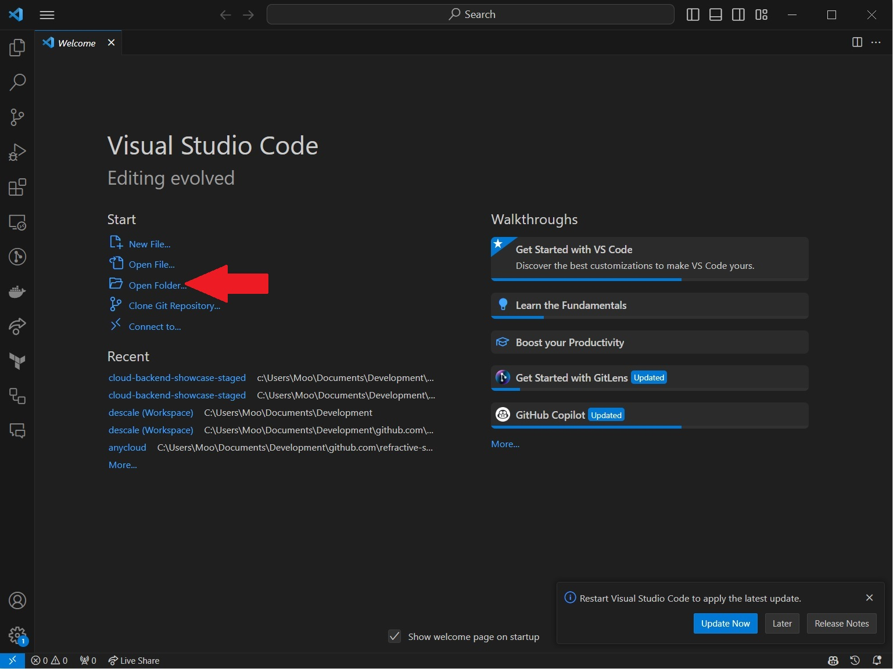
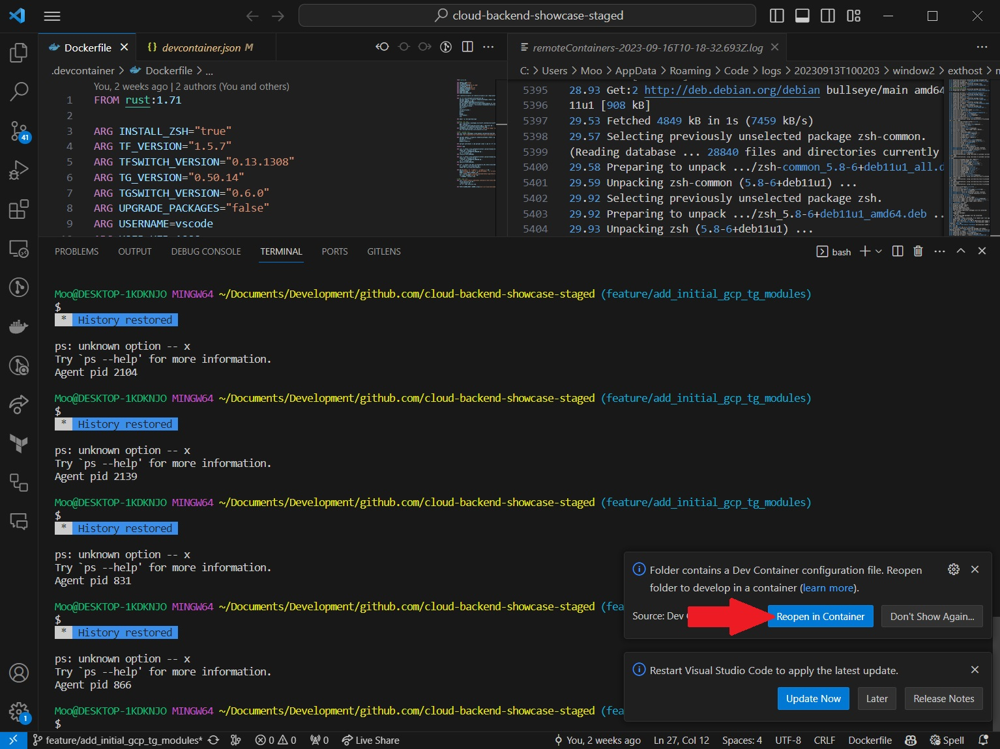
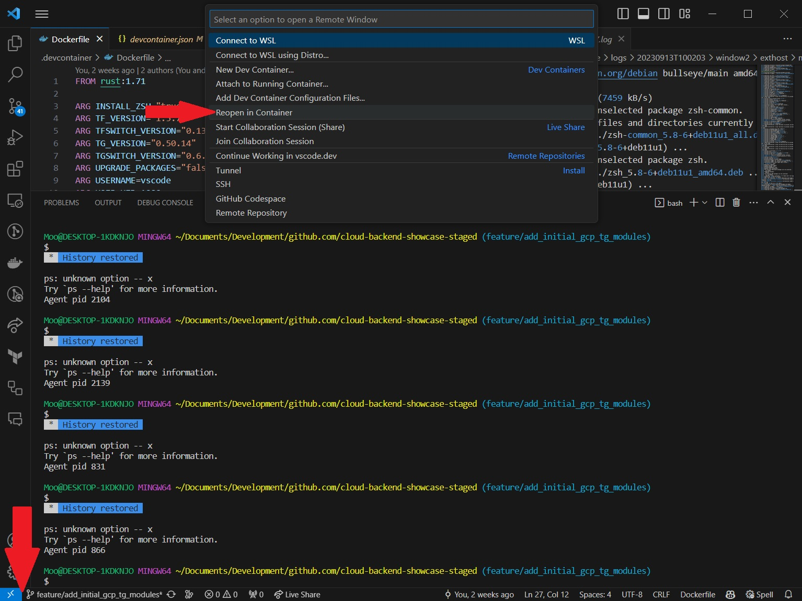
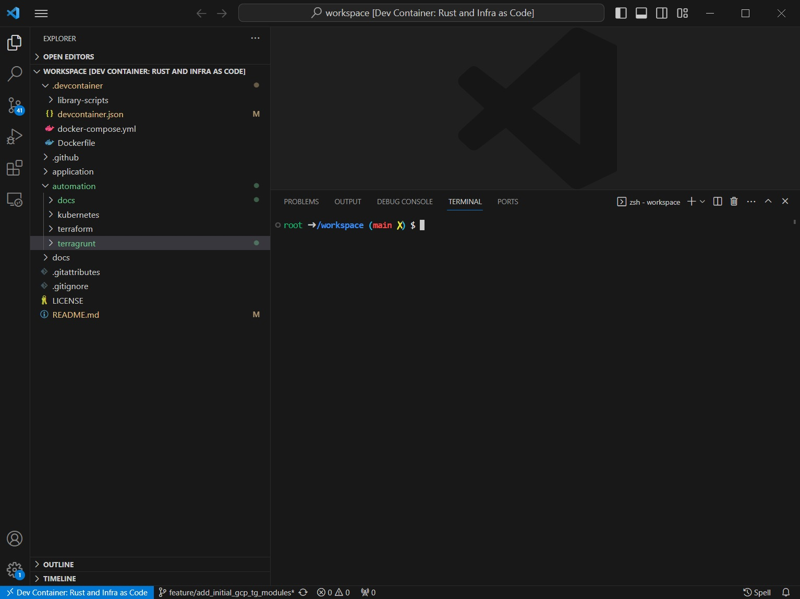

# Overview

This folder contains Terragrunt configurations for the deployment of infrastructure in GCP. This content is intended to be a Proof of Concept (PoC) around automating infrastructure provisioning and deployments. These configurations are purely academic and should not be used in production.

## Prerequisites

### Local Development
The following tools will need to be installed to be able to follow along with the deployment steps (see below):
- [GCP CLI](https://cloud.google.com/sdk/docs/install)
- [Terraform](https://learn.hashicorp.com/tutorials/terraform/install-cli)
- [Terragrunt](https://terragrunt.gruntwork.io/docs/getting-started/install/)
- [TFSwitch](https://tfswitch.warrensbox.com/Install/)
- [TGSwitch](https://tgswitch.warrensbox.com/Install/)

### VSCode Dev Containers
- Set up VSCode to work with [Dev Containers](https://code.visualstudio.com/docs/devcontainers/containers).

- Open a new VSCode window, click on "Open Folder" and select the folder containing this repository.

  

- (Option 1) Select "Reopen in Container".

  

- (Option 2) Click on the Dev Container icon, bottom left (see bottommost red arrow), and select "Reopen in Container" (topmost red arrow).

  

- You should now have a window like the following:

  

# Deployment steps:

1. 